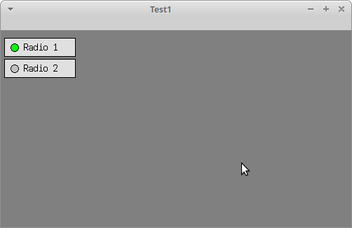

# w32x
A Win32 inspired API/wrapper over Xlib/X11 for Linux and Unix machines.

[](https://travis-ci.com/devinsmith/w32x)



# Requirements
Debian based systems require the following libraries:
```
sudo apt-get install libx11-dev libxft-dev
```

# Building

You can use standard ./configure to build the static library and tests.
```
./configure
make
make test
```
This will create a libw32x.a library and build a sample app
that utilizes the library.

Alternatively, CMake files are provided but they may not necessarily be
up to date.

